# [ICASSP 2025] Camouflaged Object Detection via Neural Architecture Search
Xin Li, Keren Fu, Qijun Zhao<br />

## ✈ Abstract
The core challenge in camouflaged object detection (COD) is
identifying objects that blend seamlessly with their surroundings. Existing
methods emulate the strategies biological organisms break camouflage
by manually constructing modules with expert knowledge from existing
segmentation tasks, making it difficult to accurately understand complex
and unique camouflage semantics. We are the first to apply neural
architecture search (NAS) to COD, introducing an automatic localization
and refinement network called ALRNet. It explores a large search
space to discover more effective camouflage-specific modules. Specifically,
we propose a search-based automatic receptive field block (ARFB)
to adaptively excavate hierarchical discriminative cues and decouple
features in a multi-branch architecture. Moreover, we introduce an
edge-assisted explicit and implicit refinement (EEIR) module, combining
explicit priors with implicit search to create a dual-task structure for
edge and segmentation knowledge interaction.

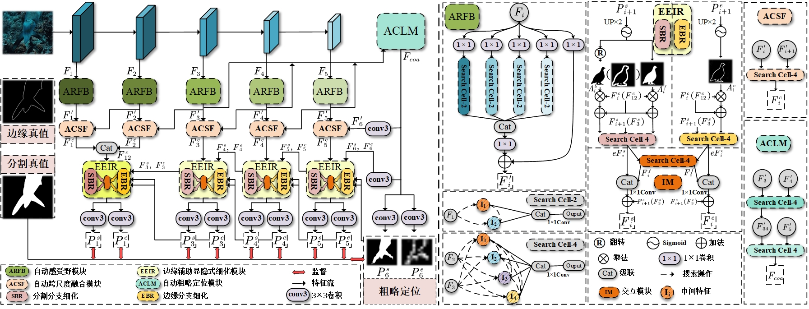

## ✈ Environmental Setups
`PyTorch 1.8.0 + CUDA 11.1`. Please install corresponding PyTorch and CUDA versions.
To create anaconda environment directly, please run flowing commands.
```
conda create -n ALRNet python=3.8.19
conda activate ALRNet
pip install -r requirements.txt
```
For the requirements.txt, please click [HERE](https://pan.baidu.com/s/15ympfR_ITEiypNdSAoj-HQ), password: 7qyn.

## ✈ Dataset and Training
Please download the [dataset](https://drive.google.com/file/d/1M8-Ivd33KslvyehLK9_IUBGJ_Kf52bWG/view?usp=sharing) first and place them in the "**COD_dataset**" directory. The structure of the "**COD_dataset**" folder should be as follows:
```
COD_dataset
└──train_set
    └── edge
    ├── gt
    └── img
└──test_set
    └── CAMO
        ├──im
    	├──gt
    ├── COD10K
    ├── CHAMELEON
    └── NC4K
```
To train or validate the ALRNet, please run:
```
python train.py
```
Download the Res2Net50 backbone weights at [HERE](https://pan.baidu.com/s/1e2iVJDZmDDHxYiP3o9fu8w), password: 2s5e.
Download our ALRNet weights at ([HERE](https://pan.baidu.com/s/1PtwIYT_XT7dh7tni-j2QVw), password: 6qcu) into `./checkpoints/Net_epoch_best.pth`, modify the para path in train.py, and run infer method in train.py to generate prediction masks.
We also provide the prediction masks at [HERE]().

## ✈ Quantitative Results
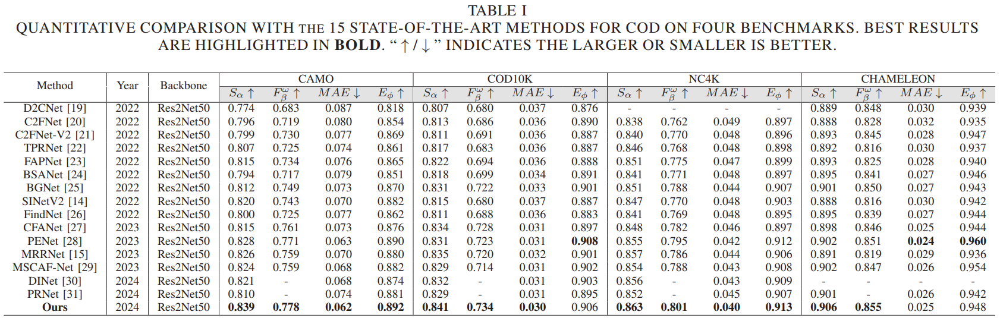

## ✈ Visual Results


## ✈ Citation
If you use ALRNet in your research or wish to refer our work, please use the following BibTeX entry.
```
@inproceedings{li2025camouflaged,
  title={Camouflaged Object Detection via Neural Architecture Search},
  author={Li, Xin and Fu, Keren and Zhao, Qijun},
  booktitle={ICASSP 2025-2025 IEEE International Conference on Acoustics, Speech and Signal Processing (ICASSP)},
  pages={1--5},
  year={2025},
  organization={IEEE}
}
```

## ✈ The search results of ALRNet:
<div align=center>
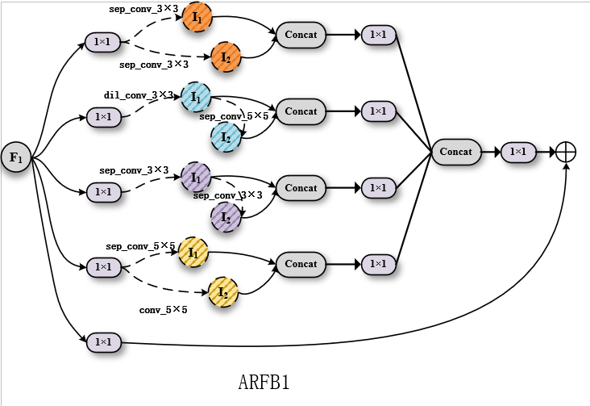
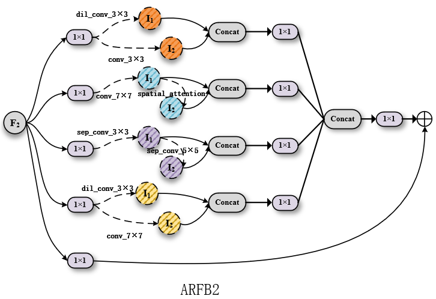
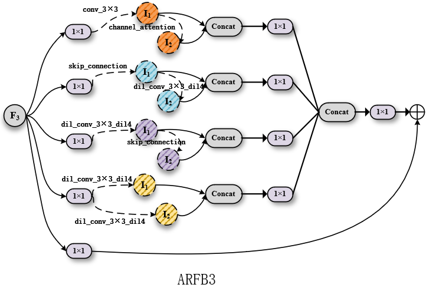
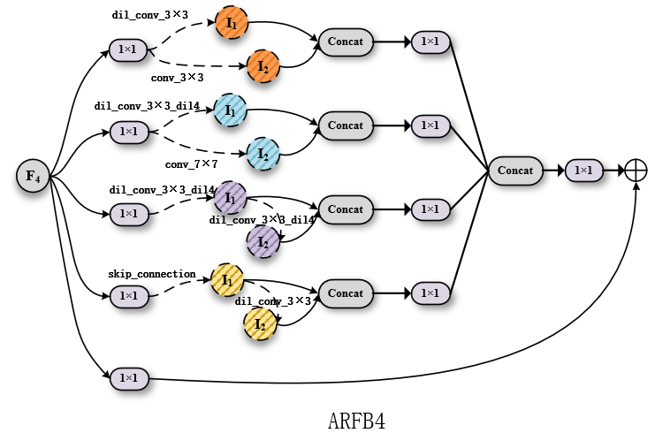
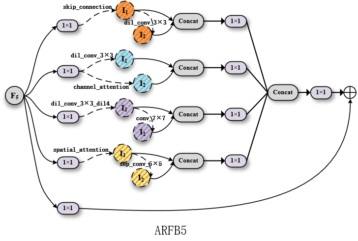
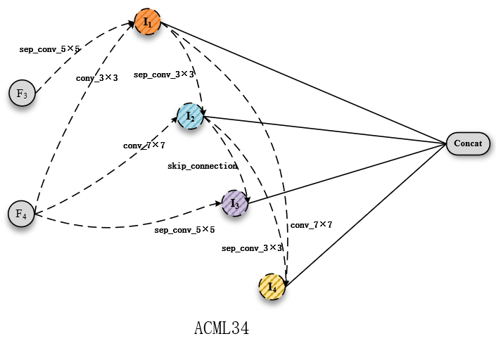
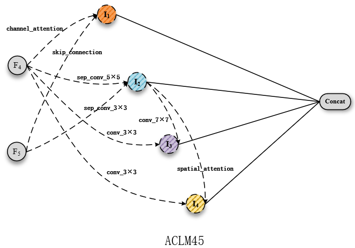
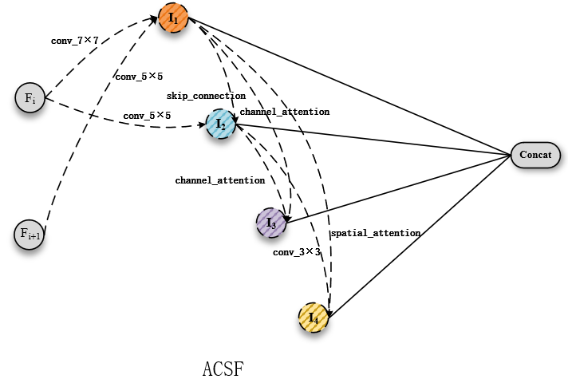
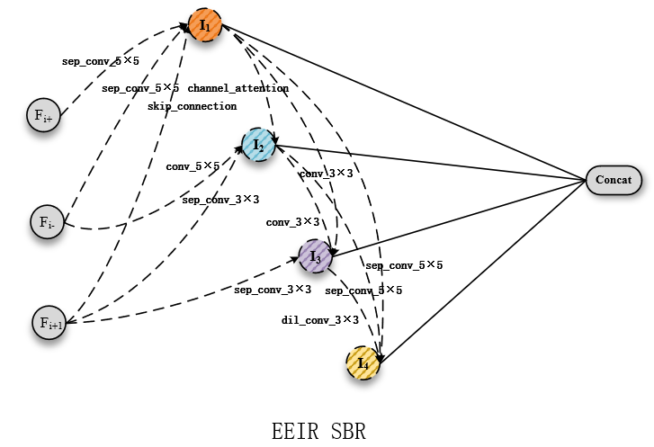
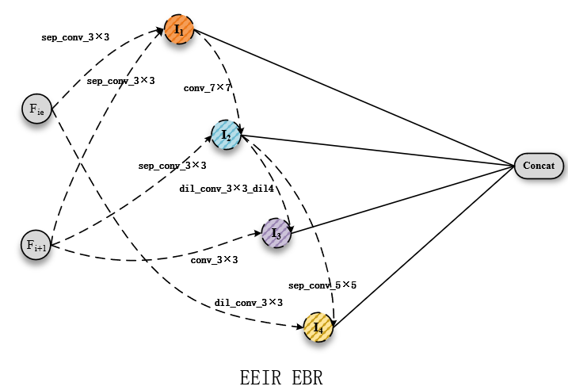
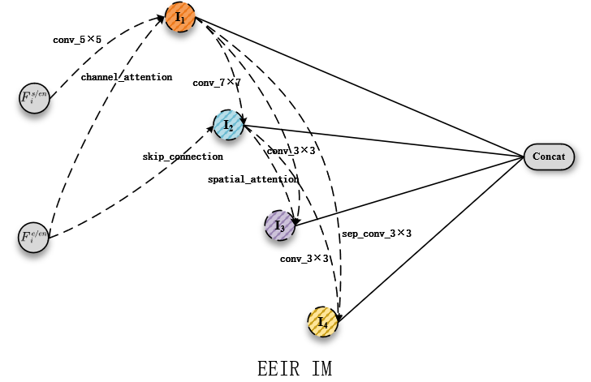
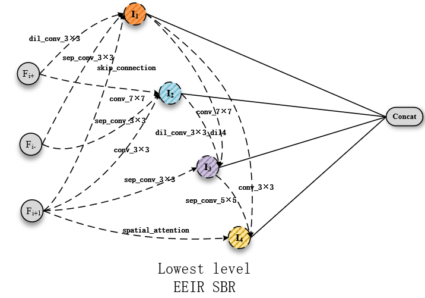
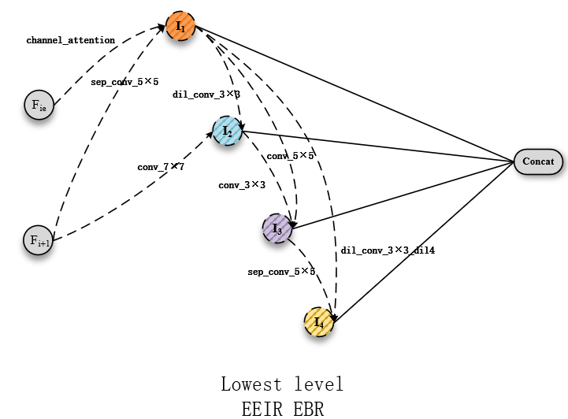
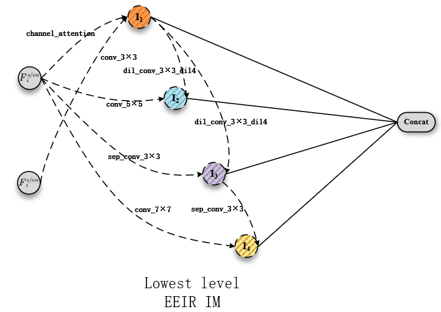
</div>
